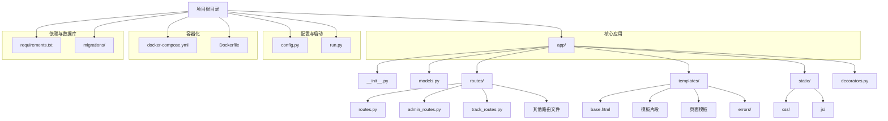
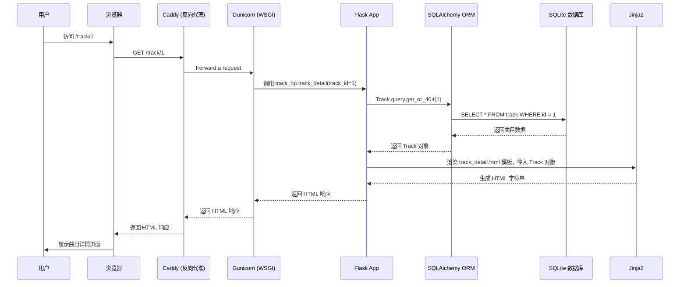
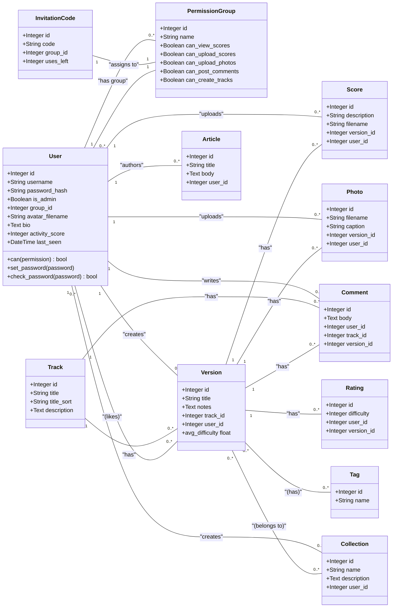

# Flask 合唱团曲库项目深度分析

本文档旨在对现有的基于 Flask 的合唱团曲库项目进行全面的技术拆解和分析。分析将涵盖项目架构、核心数据模型和前端设计三个主要方面，为后续迁移到 Next.js + Payload 架构提供清晰、详细的参考依据。

## 1. 项目架构分析

该项目采用经典的 Flask Web 应用程序结构，通过蓝图（Blueprints）来组织路由，实现了模块化的代码管理。

### 1.1. 目录结构

项目的文件和目录组织清晰，职责分明。

- **`run.py`**: 项目的入口点，用于启动 Gunicorn 服务器。
- **`config.py`**: 存放应用配置，如密钥、数据库 URI、上传文件夹路径以及 AI 服务相关的配置。
- **`docker-compose.yml` & `Dockerfile`**: 定义了项目的容器化环境，使用 Gunicorn 作为 WSGI 服务器，并挂载了数据卷以持久化数据库（`/app/instance`）、上传文件（`/app/uploads`）和数据库迁移脚本（`/app/migrations`）。
- **`app/`**: 核心应用目录。
  - **`__init__.py`**: 应用工厂函数 `create_app` 所在地。负责初始化 Flask 应用、数据库、登录管理器等扩展，并注册蓝图和自定义命令行。
  - **`models.py`**: 定义了所有 SQLAlchemy 数据模型，是整个应用的数据结构核心。
  - **路由文件 (`admin_routes.py`, `track_routes.py`, etc.)**: 每个文件是一个蓝图，分别处理特定模块的路由逻辑，如管理员后台、曲目管理、用户资料等。
  - **`templates/`**: 存放所有 Jinja2 模板。
    - `base.html`: 基础模板，定义了所有页面的通用布局、导航栏、页脚和引入的 CSS/JS。
    - `_*.html`: 可重用的模板片段（Partials），如评论区 (`_comments.html`)、项目卡片 (`_item_cards.html`)，通过 `` 标签在其他模板中调用。
    - 其他 `.html` 文件：具体的页面模板。
  - **`static/`**: 存放静态文件，但在此项目中，主要依赖 CDN，本地静态文件较少。上传的文件被存储在根目录的 `uploads/` 文件夹中，这是一个由 Docker Volume 管理的独立目录。
  - **`decorators.py`**: 包含自定义装饰器，如 `permission_required`，用于实现基于角色的访问控制。

### 1.2. 路由与数据流

应用通过蓝图将路由分发到不同的处理函数。数据流通常遵循以下模式：

- **请求入口**: 用户请求通过 Caddy 反向代理到达 Gunicorn。
- **路由匹配**: Flask 根据 URL 路径 (`/track/<int:track_id>`) 匹配到 `track_routes.py` 中定义的 `track_detail` 视图函数。
- **数据处理**: 视图函数通过 SQLAlchemy ORM (`app/models.py`) 查询数据库，获取所需数据。
- **权限控制**: 许多路由（特别是 POST 请求和管理后台）使用 `@login_required` 和自定义的 `@permission_required` 装饰器 (`app/decorators.py`) 来验证用户身份和权限。
- **模板渲染**: Flask 将获取的数据传递给 Jinja2 模板 (`app/templates/track_detail.html`)。
- **响应生成**: Jinja2 引擎渲染模板，生成最终的 HTML，然后通过 Gunicorn 和 Caddy 返回给用户的浏览器。
- **异步加载**: 在主页 (`index.html`) 和成员页 (`members.html`)，页面首先加载一个骨架，然后通过 JavaScript (`fetch`) 调用后端的 API 端点（如 `/load-items`, `/api/load-members`）来动态加载内容，实现无限滚动效果。

## 2. 核心数据模型分析

项目的核心是其数据库设计，通过 SQLAlchemy ORM 定义。模型之间的关系构成了业务逻辑的基础。

### 2.1. ER 类图

下面的 Mermaid 类图展示了主要的数据库模型及其关系：

### 2.2. 数据模型详解

下表详细说明了每个核心模型及其字段和关系。

| 模型 (Model) | 描述 | 关键字段 | 关系 (Relationships) |
|--------------|------|----------|---------------------|
| User | 用户模型，支持认证、权限和个人信息。 | username, password_hash, is_admin, avatar_filename, bio, activity_score | group (M-1, PermissionGroup), versions (1-M), scores (1-M), photos (1-M), comments (1-M), liked_versions (M-M, Version), ratings (1-M), articles (1-M), collections (1-M) |
| PermissionGroup | 权限组，定义了不同用户组的操作权限。 | name, can_view_scores, can_upload_scores, can_create_tracks, etc. | users (1-M, User) |
| InvitationCode | 注册邀请码，用于控制新用户注册及其初始权限组。 | code, group_id, uses_left | group (M-1, PermissionGroup) |
| Track | 曲目，是音乐作品的最高层级实体。 | title, description | versions (1-M, Version), comments (1-M, Comment) |
| Version | 版本，代表一个曲目的特定编排或演绎。 | title, notes, track_id, user_id | track (M-1, Track), creator (M-1, User), scores (1-M), photos (1-M), comments (1-M), likes (M-M, User), ratings (1-M), tags (M-M, Tag), collections (M-M, Collection) |
| Score | 乐谱文件，通常是 PDF。 | description, filename, version_id | version (M-1, Version), uploader (M-1, User) |
| Photo | 照片文件，用于记录演出或活动。 | filename, caption, version_id | version (M-1, Version), uploader (M-1, User) |
| Comment | 评论，可以附加到曲目或版本上。 | body, track_id, version_id | author (M-1, User), track (M-1, Track), version (M-1, Version) |
| Tag | 标签，用于对版本进行分类。 | name | versions (M-M, Version) |
| Rating | 评分，用户对版本的难度评分。 | difficulty, user_id, version_id | user (M-1, User), version (M-1, Version) |
| Collection | 乐集，用户创建的版本集合。 | name, description | creator (M-1, User), versions (M-M, Version) |
| Article | 署名文章，由用户撰写的独立内容。 | title, body | author (M-1, User) |
| SystemSetting | 系统设置，键值对存储，用于控制如"是否开放注册"等全局配置。 | key, value | (无) |

## 3. 前端设计分析

项目前端使用 Bootstrap 5 作为核心 UI 框架，并结合了现代的字体、图标和一些 JavaScript 库来增强用户体验。

### 3.1. 视觉与布局

- **UI 框架**: **Bootstrap 5.1.3** 提供了网格系统、卡片、表单、模态框、导航栏等基础组件。
- **设计风格**: 整体设计简洁、现代，类似于 Apple 的设计语言。
  - **颜色**: 定义在 `base.html` 的 `:root` 中，使用 `--bg-color`, `--card-bg-color`, `--accent-color` 等 CSS 变量，便于主题管理。
  - **字体**: 使用 Google Fonts 提供的 `Montserrat` (标题) 和 `Source Sans Pro` (正文)，提升了页面的视觉效果和可读性。
  - **卡片式设计**: 核心内容如曲目、用户、照片等都以卡片 (`.track-card`) 的形式展示，并带有悬停动效 (`transform: translateY(-5px); box-shadow: ...;`)，增加了页面的动态感。
- **瀑布流布局**: 在主页 (`index.html`) 和成员页 (`members.html`)，使用了 **Macy.js** 库来实现瀑布流布局，使得不同高度的卡片能够紧凑、美观地排列。
- **响应式设计**: 通过 Bootstrap 的网格系统和响应式断点 (`@media`)，确保了在桌面、平板和移动设备上都有良好的显示效果。

### 3.2. 交互与功能

- **富文本内容**: 大量的文本字段（如简介、评论、文章）支持 **Markdown** 格式，通过后端的 `markdown` 库和模板过滤器 `| markdown | safe` 进行渲染，允许用户创建格式丰富的文本。
- **动态加载 (Infinite Scroll)**: 主页和成员列表页通过监听滚动事件，使用 `fetch` API 向后端请求下一页的数据 (`/load-items`, `/api/load-members`)，并将返回的 HTML 片段动态插入到页面中，实现了无限滚动加载，提升了大数据量下的浏览体验。
- **即时编辑 (In-place Editing)**: 在曲目和版本详情页，用户可以直接点击“编辑”按钮，在当前页面切换到表单进行修改，而无需跳转到新的编辑页面。这是通过简单的 JavaScript (`toggleEdit` 函数) 和 `fetch` API 提交表单实现的。
- **图片/PDF 预览**:
  - 图片预览 (`_item_cards.html`, `version_detail.html`)：点击图片会触发 `openPhotoPreview` 函数，弹出一个 Bootstrap 模态框 (`#photoPreviewModal`) 来显示大图。
  - PDF 预览 (`version_detail.html`)：点击“预览”按钮也会弹出一个模态框 (`#pdfPreviewModal`)，其中内嵌一个 `<iframe>` 来加载和显示 PDF 文件，无需下载。
- **AI 文本润色**: 在版本说明和曲目介绍的编辑区，提供了一个“AI 润色”按钮。点击后，它会调用后端的 `/api/polish-text` 接口，该接口再请求阿里云的 DashScope AI 服务，并将润色后的文本返回填充到文本框中。
- **实时标题检查**: 在创建新曲目时 (`_form_helpers.html`)，输入标题会触发一个带防抖（debounce）的 `fetch` 请求到 `/track/check-title`，实时检查是否存在同名或相似的曲目，避免重复创建。
- **动态侧边栏**: 导航栏的“最新动态”链接会触发一个 Bootstrap 的 Offcanvas 组件，从右侧滑出，并通过 `fetch` 异步加载最新的评论 (`/api/latest-comments`)。

**总结**: 这个 Flask 项目是一个功能完整、结构清晰、设计现代的 Web 应用。它很好地利用了 Flask 蓝图进行模块化，通过 SQLAlchemy 实现了强大的数据建模，并结合 Bootstrap 和少量 JavaScript 库构建了富有交互性的前端界面。在进行技术栈迁移时，以上分析可以作为新系统在数据结构、业务逻辑和前端功能实现上的重要参考。